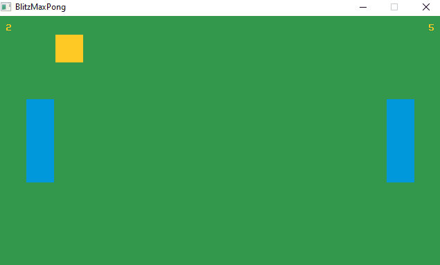

# Pong sur BlitzMax

par *flashjaysan*

## Introduction



Ce document est un tutoriel pour réaliser un clone du jeu Pong avec le langage BlitzMax. Le document est prévu pour être suivi dans l'ordre et propose une approche progressive et continue d'amélioration du code.

- Dans un premier temps, on réalisera le projet sans aucune organisation.
- Puis on structurera le code dans des fonctions pour le rendre plus modulaire.
- On passera ensuite à une organisation via la programmation orientée objet.
- On terminera par diverses optimisations.

## Choix techniques

- Résolution de 640x360 pixels en 16/9.
- Positionnement inital des éléments sur une grille de 40x40 pixels constituée de 16x9 tuiles.
- L'arrière plan est rempli d'une couleur verte (51, 152, 75).
- Les paddles sont représentés par des rectangles de couleur bleue (0, 152, 220) d'1x3 tuiles.
- La balle est représentée par un rectangle de couleur jaune (255, 200, 37) d'1x1 tuile.
- Le jeu se joue à deux sur un même clavier.
- Il n'y a pas de gestion d'un paddle par l'ordinateur.
- Le joueur de gauche contrôle le paddle avec les touches `Z` (pour monter le paddle) et `S` (pour descendre le paddle).
- Le joueur de droite contrôle le paddle avec les touches `HAUT` (pour monter le paddle) et `BAS` (pour descendre le paddle).
- Pas de son ni de musique. Le projet se voulant indépendant de toute ressource externe.

## Analyse du projet

On constate la nécessité d'utiliser les éléments suivants :

- Paddle gauche : un rectangle de couleur de 1x3 cases.
- Paddle droit : idem.
- Balle : un carré de couleur de 1x1 case.
- Score gauche : un texte.
- Score droite : un texte.

**Remarque :** La position des éléments sera représentée en réalité par le coin supérieur gauche de leur rectangle. Cela sera utile pour placer facilement les éléments sur la grille. En revanche, il faudra être vigilant par rapport au centre et aux bords de ces rectangles.

## Tutoriel

### Version basique

#### Squelette de base

On commence le projet en choisissant le mode `SuperStrict`. Ce mode nous oblige à déclarer toutes les variables avant leur utilisation et à leur attribuer un type explicitement.

```
SuperStrict
```

On crée la fenêtre de jeu.

```
Graphics(640, 360)
```

Pour que le jeu ne se termine pas immédiatement, on crée la boucle de jeu. On utilise une boucle `While` avec une variable booléenne (`Int` dans BlitzMax) initialisée à `vrai`. Cela crée une boucle de jeu infinie tant que la variable est vraie. Si l'utilisateur ferme la fenêtre, la variable prend la valeur `faux` et la boucle de jeu se termine.

```
Local gameloop_running: Int = True

While gameloop_running
	gameloop_running = Not AppTerminate()
Wend
```

On efface la surface d'affichage. Comme on veut la remplir avec notre couleur verte, nous devons définir la couleur de remplissage (lorsqu'on efface la surface) avant la boucle de jeu. On en profite pour échanger les tampons d'affichage arrière et avant.

```
SetClsColor(51, 152, 75)

While gameloop_running
	gameloop_running = Not (AppTerminate() Or KeyDown(KEY_ESCAPE))
	Cls()
	Flip()
Wend
```

#### Paddle gauche

Comme on va placer les divers éléments sur la grille au départ, on définit une variable `tile_size` pour représenter la taille des tuiles.

```
Local tile_size: Int = 40
```

On définit deux variables `left_paddle_x` et `left_paddle_y` qui indiquent la position du paddle gauche. On utilise la taille des tuiles pour déterminer sa position à l'écran.

```
Local left_paddle_x: Float = tile_size
Local left_paddle_y: Float = tile_size * 3
```

**Remarque :** Pourquoi le type `Float` ? Car si on applique un déplacement au paddle et qu'il n'est pas entier, lors de l'affectation à une variable de type entier, il sera converti en entier et la partie décimale sera perdue.

On dessine un rectangle de couleur bleue pour représenter le paddle gauche. Il faut d'abord définir la couleur de dessin puis dessiner le rectangle.

```
SetColor(0, 152, 220)
DrawRect(left_paddle_x, left_paddle_y, tile_size, tile_size * 3)
```

Pour le mouvement, on crée une variable `paddle_speed` pour définir la vitesse des paddles.

```
Local paddle_speed: Float = 5
```

Pour le mouvement du paddle gauche, on lui applique la vitesse, positivement ou négativement, selon la touche appuyée par le joueur.

```
If KeyDown(KEY_Z)
    left_paddle_y :- paddle_speed
End If
If KeyDown(KEY_S)
    left_paddle_y :+ paddle_speed
End If
```

Utiliser deux `if` séparés au lieu d'un `if else if` permet de gérer l'appui sur les deux touches simultanées. Si le joueur appuie sur les deux touches en même temps, le paddle reste immobile.

**Remarque :** Si vous exécutez le jeu, vous constaterez que le paddle peut sortir de la zone visible eu haut et en bas. On doit donc tester sa position dans l'écran et rétablir une position correcte pour forcer le paddle à rester dans la zone visible.

Pour le bord supérieur de l'écran, il suffit de vérifier que la position verticale du paddle est positive ou nulle. Si ce n'est pas le cas, on positionne le paddle au bord de la fenêtre (`0`).

```
If left_paddle_y < 0
    left_paddle_y = 0
EndIf
```

Pour le bord inférieur de l'écran, c'est plus compliqué. La position du paddle est représentée par le coin supérieur gauche du rectangle. Il faut donc vérifier si la position verticale est supérieure à trois case au dessus du bord inférieur de la fenêtre (le paddle faisant trois tuiles de haut) soit six cases du bord supérieur de la fenêtre. Si ce n'est pas le cas, on positionne le paddle au bord de cette case.

```
If left_paddle_y > tile_size * 6
    left_paddle_y = tile_size * 6
EndIf
```

#### Paddle droit

On définit deux variables `right_paddle_x` et `right_paddle_y` qui indiquent la position du paddle droit. A nouveau, on utilise la taille des tuiles pour déterminer sa position à l'écran.

```
Local right_paddle_x: Float = tile_size * 14 
Local right_paddle_y: Float = tile_size * 3
```

On dessine un rectangle de couleur bleue pour représenter le paddle droit. Il faut d'abord définir la couleur de dessin puis dessiner le rectangle.

```
DrawRect(right_paddle_x, right_paddle_y, tile_size, tile_size * 3)
```

**Remarque :** Les deux paddles étant de la même couleur dans ce projet, il est inutile de définir la couleur de dessin pour le paddle droit. Bien entendu, si on venait à changer la couleur de dessin pour dessiner la balle, il faudrait modifier à nouveau cette couleur pour les autres éléments. Ici, on a choisi de dessiner les deux paddles avant de dessiner la balle pour éviter de modifier la couleur deux fois au lieu d'une.

- Changement de couleur pour les paddles.
- Dessin du paddle gauche.
- Dessin du paddle droit.
- Changement de couleur pour la balle.
- Dessin de la balle.

Pour le mouvement du paddle droit, on lui applique la vitesse, positivement ou négativement, selon la touche appuyée par le joueur.

```
If KeyDown(KEY_UP)
    right_paddle_y :- paddle_speed
End If
If KeyDown(KEY_DOWN)
    right_paddle_y :+ paddle_speed
End If
```

**Remarque :** Comme pour le paddle gauche, le paddle droit peut sortir de la zone visible eu haut et en bas. On doit donc tester sa position dans l'écran et rétablir une position correcte pour forcer le paddle à rester dans la zone visible.

Pour le bord supérieur de l'écran, il suffit de vérifier que la position verticale du paddle est positive ou nulle. Si ce n'est pas le cas, on positionne le paddle au bord de la fenêtre (`0`).

```
If right_paddle_y < 0
    right_paddle_y = 0
EndIf
```

Pour le bord inférieur de l'écran, c'est plus compliqué. La position du paddle est représentée par le coin supérieur gauche du rectangle. Il faut donc vérifier si la position verticale est supérieure à trois case au dessus du bord inférieur de la fenêtre (le paddle faisant trois tuiles de haut) soit six cases du bord supérieur de la fenêtre. Si ce n'est pas le cas, on positionne le paddle au bord de cette case.

```
If right_paddle_y > tile_size * 6
    right_paddle_y = tile_size * 6
EndIf
```

#### Scores

Chaque joueur a son propre score. On définit donc deux variables `left_score` et `right_score` qu'on initialise à `0`.

```
Local left_score: Int = 0
Local right_score: Int = 0
```

Pour afficher les score, on définit une position horizontale avec les variables `left_score_x` et `right_score_x` et verticale. La position verticale de ces deux scores étant la même, on définit une seule variable `score_y`.

```
Local left_score_x: Int = 10
Local right_score_x: Int = 620
Local score_y: Int = 10
```

On affiche les scores à l'écran en utilisant les différentes variables et constantes créées.

```
DrawText(String(left_score), left_score_x, score_y)
DrawText(String(right_score), right_score_x, score_y)
```

**Remarque :** Les scores étant des entiers, il faut les convertir en chaînes avec la commande `String`.

#### Balle

On définit deux variables `ball_x` et `ball_y` qui indiquent la position de la balle. A nouveau, on utilise la taille des tuiles pour déterminer sa position à l'écran.

```
Local ball_x: Float = tile_size * 8
Local ball_y: Float = tile_size * 4
```

**Remarque :** Si vous êtes rigoureux, vous avez peut-être remarqué que la balle n'est pas tout à fait au centre de l'écran. Cela est dû au fait que notre résolution est composée d'une grille 16x9. Le nombre de cases horizontale étant pair, on ne peut pas positionner un élément au centre. Pour corriger ce problème, on peut soustraire à la position, la moitié de la taille de la balle (qui rappelons le, est de tile_size). Le problème ne se pose pas verticalement car la grille est constituée d'un nombre impair de cases verticalement.

```
Local ball_x: Int = tile_size * 8 - tile_size / 2
```

On dessine un rectangle de couleur jaune pour représenter la balle. Il faut d'abord définir la couleur de dessin puis dessiner le rectangle.

```
SetColor(255, 200, 37)
DrawRect(ball_x, ball_y, tile_size, tile_size)
```

Pour le mouvement de la balle, on a besoin de deux variables `ball_speed_x` et `ball_speed_y`. En effet, la balle peut se déplacer en diagonale et sa direction peut changer au cours du jeu. Pour augmenter la difficulté, on va choisir une valeur légèrement supérieure à celle des paddles.

```
Local ball_speed_x: Float = paddle_speed * 1.3
Local ball_speed_y: Float = Ppaddle_speed * 1.1
```

On applique le déplacement à la balle.

```
ball_x :+ ball_speed_x
ball_y :+ ball_speed_y
```

On doit maintenant vérifier que la balle ne touche pas les bords de l'écran. Deux cas peuvent se présenter.

- La balle touche le bord supérieur ou inférieur de l'écran : On change le sens du déplacement vertical de la balle. On doit également repositionner la balle dans l'écran pour éviter qu'elle sorte de l'écran.
- La balle touche le bord gauche ou droit de l'écran : La balle est repositionnée au centre de l'écran et on change le sens de son déplacement horizontal. En outre, le joueur opposé au bord de l'écran marque un point.

Pour le bord supérieur de l'écran, il suffit de vérifier que la position verticale de la balle est positive ou nulle. Si ce n'est pas le cas, on positionne la balle au bord de la fenêtre (`0`). On change également le signe de la valeur de déplacement vertical.

```
If ball_y < 0
    ball_y = 0
    ball_speed_y :* -1
EndIf
```

Pour le bord inférieur de l'écran, c'est plus compliqué. La position de la balle est représentée par le coin supérieur gauche du rectangle. Il faut donc vérifier si la position verticale est supérieure à une case au dessus du bord inférieur de la fenêtre (la balle faisant une tuile de haut) soit huit cases du bord supérieur de la fenêtre. Si ce n'est pas le cas, on positionne la balle au bord de cette case. On change également le signe de la valeur de déplacement vertical.

```
If ball_y > tile_size * 8
    ball_y = tile_size * 8
    ball_speed_y :* -1
EndIf
```

Pour le bord gauche de l'écran, il suffit de vérifier que la position horizontale de la balle est positive ou nulle. Si ce n'est pas le cas, on positionne la balle au centre de l'écran. On change le signe de la valeur de déplacement horizontal. Enfin, on augmente le score du joueur droit.

```
If ball_x < 0
    ball_x = tile_size * 8 - tile_size / 2
    ball_y = tile_size * 4
    ball_speed_x :* -1
	right_score :+ 1
EndIf
```

Pour le bord droit de l'écran, c'est plus compliqué. La position de la balle est représentée par le coin supérieur gauche du rectangle. Il faut donc vérifier si la position horizontale est supérieure à une case à gauche du bord droit de la fenêtre (la balle faisant une tuile de large) soit quinze cases du bord gauche de la fenêtre. Si ce n'est pas le cas, on positionne la balle au centre de l'écran. On change le signe de la valeur de déplacement horizontal. Enfin, on augmente le score du joueur gauche.

```
If ball_x > tile_size * 15
    ball_x = tile_size * 8 - tile_size / 2
    ball_y = tile_size * 4
    ball_speed_x :* -1
	left_score :+ 1
EndIf
```

#### Collisions

On a disposé tous les éléments à l'écran et géré leur déplacement et les scores. Mais il nous faut maintenant gérer les collisions de la balle et des paddles. Pour cela, on va utiliser la technique AABB (Axis Aligned Bounding Box) car tous les rectangles sont alignés sur les axes.

Deux rectangles alignés sur les axes entrent en contact lorsque toutes ces conditions sont remplies :

- le côté droit du premier rectangle est à droite du côté gauche du second rectangle.
- le côté gauche du premier rectangle est à gauche du côté droit du second rectangle.
- le côté haut du premier rectangle est au dessus du côté bas du second rectangle.
- le côté bas du premier rectangle est au dessous du côté haut du second rectangle.

Pour le paddle gauche, on veut que la balle soit repositionnée à droite du paddle de manière à stopper la collision. Comme le paddle est positionné verticalement sur la grille, on peut placer la balle sur la colonne suivante dans la grille. On change également le sens de sa direction horizontale.

```
If ball_x + tile_size > left_paddle_x And ball_x < left_paddle_x + tile_size And ball_y + tile_size > left_paddle_y And ball_y < left_paddle_y + tile_size * 3
    ball_x = tile_size * 2
    ball_speed_x :* -1
EndIf
```

Pour le paddle droite, on veut que la balle soit repositionnée à gauche du paddle de manière à stopper la collision. Comme le paddle est positionné verticalement sur la grille, on peut placer la balle sur la colonne précédente dans la grille. On change également le sens de sa direction horizontale.

```
If ball_x + tile_size > right_paddle_x And ball_x < right_paddle_x + tile_size And ball_y + tile_size > right_paddle_y And ball_y < right_paddle_y + tile_size * 3
    ball_x = tile_size * 13
    ball_speed_x :* -1
EndIf
```

#### Fin de partie

Lorsqu'un joueur marque 11 points, la partie est terminée. On doit réinitialiser les scores ainsi que les positions et directions des différents éléments.

```
If left_score >= 11 Or right_score >= 11

EndIf
```

On réinitialise la position du paddle gauche et du paddle droit. Leur position horizontale étant permanente, on ne réinitialise que la position verticale.

```
left_paddle_y = tile_size * 3
right_paddle_y = tile_size * 3
```

On réinitialise la position de la balle ainsi que sa direction.

```
ball_x = tile_size * 8 - tile_size / 2
ball_y = tile_size * 4
ball_speed_x = paddle_speed * 1.3
ball_speed_y = paddle_speed * 1.1
```

On réinitialise les scores.

```
left_score = 0
right_score = 0
```

#### Programme Complet

Voici le [programme complet](src/pong_v1.bmx) tel que nous l'avons décrit jusqu'ici.

```
SuperStrict

Local tile_size: Int = 40
Local paddle_speed: Float = 5

Local left_paddle_x: Float = tile_size
Local left_paddle_y: Float = tile_size * 3

Local right_paddle_x: Float = tile_size * 14 
Local right_paddle_y: Float = tile_size * 3

Local ball_x: Float = tile_size * 8 - tile_size / 2
Local ball_y: Float = tile_size * 4
Local ball_speed_x: Float = paddle_speed * 1.3
Local ball_speed_y: Float = paddle_speed * 1.1

Local left_score: Int = 0
Local right_score: Int = 0
Local left_score_x: Int = 10
Local right_score_x: Int = 620
Local score_y: Int = 10

Graphics(640, 360)

SetClsColor(51, 152, 75)

Local gameloop_running: Int = True

While gameloop_running
	gameloop_running = Not AppTerminate()
	
	If KeyDown(KEY_Z)
		left_paddle_y :- paddle_speed
	EndIf
	If KeyDown(KEY_S)
		left_paddle_y :+ paddle_speed
	EndIf
	If left_paddle_y < 0
		left_paddle_y = 0
	EndIf
	If left_paddle_y > tile_size * 6
		left_paddle_y = tile_size * 6
	EndIf
	If KeyDown(KEY_UP)
		right_paddle_y :- paddle_speed
	End If
	If KeyDown(KEY_DOWN)
		right_paddle_y :+ paddle_speed
	EndIf
	If right_paddle_y < 0
		right_paddle_y = 0
	EndIf
	If right_paddle_y > tile_size * 6
		right_paddle_y = tile_size * 6
	EndIf
	ball_x :+ ball_speed_x
	ball_y :+ ball_speed_y
	If ball_y < 0
		ball_y = 0
		ball_speed_y :* -1
	EndIf
	If ball_y > tile_size * 8
		ball_y = tile_size * 8
		ball_speed_y :* -1
	EndIf
	If ball_x < 0
		ball_x = tile_size * 8 - tile_size / 2
		ball_y = tile_size * 4
		ball_speed_x :* -1
		right_score :+ 1
	EndIf
	If ball_x > tile_size * 15
		ball_x = tile_size * 8 - tile_size / 2
		ball_y = tile_size * 4
		ball_speed_x :* -1
		left_score :+ 1
	EndIf
	If ball_x + tile_size > left_paddle_x And ball_x < left_paddle_x + tile_size And ball_y + tile_size > left_paddle_y And ball_y < left_paddle_y + tile_size * 3
		ball_x = tile_size * 2
		ball_speed_x :* -1
	EndIf
	If ball_x + tile_size > right_paddle_x And ball_x < right_paddle_x + tile_size And ball_y + tile_size > right_paddle_y And ball_y < right_paddle_y + tile_size * 3
		ball_x = tile_size * 13
		ball_speed_x :* -1
	EndIf
	If left_score >= 11 Or right_score >= 11
		left_paddle_y = tile_size * 3
		right_paddle_y = tile_size * 3 
		ball_x = tile_size * 8 - tile_size / 2
		ball_y = tile_size * 4
		ball_speed_x = paddle_speed * 1.3
		ball_speed_y = paddle_speed * 1.1
		left_score = 0
		right_score = 0
	EndIf
	
	Cls()
	SetColor(0, 152, 220)
	DrawRect(left_paddle_x, left_paddle_y, tile_size, tile_size * 3)
	DrawRect(right_paddle_x, right_paddle_y, tile_size, tile_size * 3)
	SetColor(255, 200, 37)
	DrawRect(ball_x, ball_y, tile_size, tile_size)
	DrawText(String(left_score), left_score_x, score_y)
	DrawText(String(right_score), right_score_x, score_y)
	Flip()
Wend
```

### Programmation procédurale

Comme vous avez pu le voir, le programme devient de plus en plus complexe à mesure que l'on ajoute des fonctionnalités. On va découper le programme en fonctions plus simples pour mieux gérer cette complexité. Copiez le programme précédent à l'exception de la première instruction (`SuperStrict`) et placez le code dans la fonction suivante. Pour faciliter la lecture du code, pensez à indenter votre code.

```
Function pong: Int()
    ' copiez tout le programme ici
EndFunction
```

Après la définition de cette fonction `pong`, ajoutez un appel à celle-ci pour que le programme exécute son code.

```
pong()
```

Tout ça c'est bien joli mais ça ne change pas grand chose. Au lieu de définir des variables directement dans le fichier source, ce qui a quand même l'avantage de rendre le programme un peu plus sûr, on les définit dans la fonction `pong`. Maintenant, on va découper cette fonction en sous-fonctions plus simples à gérer.

Pour commencer, on va créer deux fonctions `update` et `draw` qu'on appellera dans la boucle de jeu.

La fonction `update` servira à gérer les contrôles des joueurs et la logique du jeu.

```
Function update:Int()

EndFunction
```

La fonction `draw` servira à afficher les éléments du jeux.

```
Function draw:Int()

EndFunction
```

Déplacez les instructions suivantes dans la fonction `update` :

```
If KeyDown(KEY_Z)
    left_paddle_y :- paddle_speed
EndIf
If KeyDown(KEY_S)
    left_paddle_y :+ paddle_speed
EndIf
If left_paddle_y < 0
    left_paddle_y = 0
EndIf
If left_paddle_y > tile_size * 6
    left_paddle_y = tile_size * 6
EndIf
If KeyDown(KEY_UP)
    right_paddle_y :- paddle_speed
End If
If KeyDown(KEY_DOWN)
    right_paddle_y :+ paddle_speed
EndIf
If right_paddle_y < 0
    right_paddle_y = 0
EndIf
If right_paddle_y > tile_size * 6
    right_paddle_y = tile_size * 6
EndIf
ball_x :+ ball_speed_x
ball_y :+ ball_speed_y
If ball_y < 0
    ball_y = 0
    ball_speed_y :* -1
EndIf
If ball_y > tile_size * 8
    ball_y = tile_size * 8
    ball_speed_y :* -1
EndIf
If ball_x < 0
    ball_x = tile_size * 8 - tile_size / 2
    ball_y = tile_size * 4
    ball_speed_x :* -1
    right_score :+ 1
EndIf
If ball_x > tile_size * 15
    ball_x = tile_size * 8 - tile_size / 2
    ball_y = tile_size * 4
    ball_speed_x :* -1
    left_score :+ 1
EndIf
If ball_x + tile_size > left_paddle_x And ball_x < left_paddle_x + tile_size And ball_y + tile_size > left_paddle_y And ball_y < left_paddle_y + tile_size * 3
    ball_x = tile_size * 2
    ball_speed_x :* -1
EndIf
If ball_x + tile_size > right_paddle_x And ball_x < right_paddle_x + tile_size And ball_y + tile_size > right_paddle_y And ball_y < right_paddle_y + tile_size * 3
    ball_x = tile_size * 13
    ball_speed_x :* -1
EndIf
If left_score >= 11 Or right_score >= 11
    left_paddle_x = tile_size
    right_paddle_x = tile_size * 14 
    ball_x = tile_size * 8 - tile_size / 2
    ball_y = tile_size * 4
    ball_speed_x = paddle_speed * 1.3
    ball_speed_y = paddle_speed * 1.1
    left_score = 0
    right_score = 0
EndIf
```

Déplacez les instructions suivantes dans la fonction `draw` :

```
Cls()
SetColor(0, 152, 220)
DrawRect(left_paddle_x, left_paddle_y, tile_size, tile_size * 3)
DrawRect(right_paddle_x, right_paddle_y, tile_size, tile_size * 3)
SetColor(255, 200, 37)
DrawRect(ball_x, ball_y, tile_size, tile_size)
DrawText(String(left_score), left_score_x, score_y)
DrawText(String(right_score), right_score_x, score_y)
Flip()
```

Dans la boucle de jeu, appelez les fonctions `update` et `draw`.

```
While gameloop_running
    gameloop_running = Not AppTerminate()
    
    update()
    draw()
Wend
```

La boucle de jeu est maintenant beaucoup plus concise. Le problème, c'est que notre programme ne fonctionne plus. En effet, les variables locales à la fonction `pong`, ne sont plus accessibles dans les fonction `update` et `draw`.

On doit passer à ces fonctions toutes les variables qu'elles souhaitent utiliser. Pour ça, on regarde dans les instructions de ces fonctions et on ajoute les variables utilisées lors de leur appel. 

```
While gameloop_running
    gameloop_running = Not AppTerminate()
    
    update(left_paddle_x,
            left_paddle_y,
            right_paddle_x,
            right_paddle_y,
            paddle_speed,
            tile_size,
            ball_x,
            ball_y,
            ball_speed_x,
            ball_speed_y,
            right_score,
            left_score)
    draw(left_paddle_x,
            left_paddle_y,
            right_paddle_x,
            right_paddle_y,
            tile_size,
            ball_x,
            ball_y,
            left_score,
            left_score_x,
            right_score,
            right_score_x,
            score_y)
Wend
```

Il faut également préciser dans la signature de ces fonctions, les noms des paramètres et leur type.

```
Function update:Int(left_paddle_x: Float,
		       left_paddle_y: Float Var,
		       right_paddle_x: Float,
		       right_paddle_y: Float Var,
		       paddle_speed: Float,
		       tile_size: Int,
		       ball_x: Float Var,
		       ball_y: Float Var,
		       ball_speed_x: Float Var,
		       ball_speed_y: Float Var,
		       right_score: Int Var,
		       left_score: Int Var)
    ...
```

**Attention !** Notez bien que les variables qui sont modifiées dans la fonction ont également le mot clé `Var` pour indiquer qu'on souhaite modifier ces paramètres. Cela a pour effet de passer ces paramètres via une référence afin que la fonction puisse modifier leur valeur.

```
Function draw:Int(left_paddle_x: Float,
		     left_paddle_y: Float,
		     right_paddle_x: Float,
		     right_paddle_y: Float,
		     tile_size: Int,
		     ball_x: Float,
		     ball_y: Float,
		     left_score: Int,
		     left_score_x: Int,
		     right_score: Int,
		     right_score_x: Int,
		     score_y: Int)
    ...
```

**Remarque :** La fonction `draw` ne fait qu'afficher des choses. Elle ne modifie pas les paramètres. Elle n'utilise donc pas le mot clé `Var` contrairement à la fonction `update`.

Le programme fonctionne à nouveau. Mais on peut encore découper le code en sous fonctions.

Créer une fonction `move_left_paddle` qui s'occupera du déplacement du paddle gauche.

```
Function move_left_paddle()
	
EndFunction
```

Déplacez le code suivant depuis la fonction `update` vers la fonction `move_left_paddle`.

```
If KeyDown(KEY_Z)
    left_paddle_y :- paddle_speed
EndIf
If KeyDown(KEY_S)
    left_paddle_y :+ paddle_speed
EndIf
If left_paddle_y < 0
    left_paddle_y = 0
EndIf
If left_paddle_y > tile_size * 6
    left_paddle_y = tile_size * 6
EndIf
```

**Remarque :** A nouveau, on doit ajuster la signature de cette fonction pour prendre des paramètres. Le seul paramètre modifié (`left_paddle_y`) a le mot clé `Var`.

```
Function move_left_paddle(left_paddle_y: Float Var,
                          paddle_speed: Float,
                          tile_size: Int)
    If KeyDown(KEY_Z)
        left_paddle_y :- paddle_speed
    EndIf
    If KeyDown(KEY_S)
        left_paddle_y :+ paddle_speed
    EndIf
    If left_paddle_y < 0
        left_paddle_y = 0
    EndIf
    If left_paddle_y > tile_size * 6
        left_paddle_y = tile_size * 6
    EndIf
EndFunction
```

Dans la fonction `update`, à la place du code que vous avez déplacé, appelez la fonction `move_left_paddle` avec les bons arguments.

```
move_left_paddle(left_paddle_y, paddle_speed, tile_size)
```

De même, pour le déplacement du paddle droit, on crée la fonction `move_paddle_right`.

Voici sa version complète.

```
Function move_right_paddle(left_paddle_y: Float Var,
                          paddle_speed: Float,
                          tile_size: Int)
	If KeyDown(KEY_UP)
		right_paddle_y :- paddle_speed
	End If
	If KeyDown(KEY_DOWN)
		right_paddle_y :+ paddle_speed
	EndIf
	If right_paddle_y < 0
		right_paddle_y = 0
	EndIf
	If right_paddle_y > tile_size * 6
		right_paddle_y = tile_size * 6
	EndIf
EndFunction
```

Et voici son appel depuis la fonction `update`.

```
move_right_paddle(right_paddle_y, paddle_speed, tile_size)
```

Pour le déplacement de la balle, on crée la fonction `move_ball`.

Voici sa version complète.

```
Function move_ball(ball_x: Float Var,
                   ball_y: Float Var,
                   ball_speed_x: Float Var,
                   ball_speed_y: Float Var,
                   tile_size: Int,
                   left_score: Int Var,
                   right_score: Int Var,
                   left_paddle_x: Float,
                   left_paddle_y: Float,
                   right_paddle_x: Float,
                   right_paddle_y: Float)
	ball_x :+ ball_speed_x
	ball_y :+ ball_speed_y
	If ball_y < 0
		ball_y = 0
		ball_speed_y :* -1
	EndIf
	If ball_y > tile_size * 8
		ball_y = tile_size * 8
		ball_speed_y :* -1
	EndIf
	If ball_x < 0
		ball_x = tile_size * 8 - tile_size / 2
		ball_y = tile_size * 4
		ball_speed_x :* -1
		right_score :+ 1
	EndIf
	If ball_x > tile_size * 15
		ball_x = tile_size * 8 - tile_size / 2
		ball_y = tile_size * 4
		ball_speed_x :* -1
		left_score :+ 1
	EndIf
	If ball_x + tile_size > left_paddle_x And ball_x < left_paddle_x + tile_size And ball_y + tile_size > left_paddle_y And ball_y < left_paddle_y + tile_size * 3
		ball_x = tile_size * 2
		ball_speed_x :* -1
	EndIf
	If ball_x + tile_size > right_paddle_x And ball_x < right_paddle_x + tile_size And ball_y + tile_size > right_paddle_y And ball_y < right_paddle_y + tile_size * 3
		ball_x = tile_size * 13
		ball_speed_x :* -1
	EndIf
EndFunction
```

Et voici son appel depuis la fonction `update`.

```
move_ball(ball_x,
          ball_y,
          ball_speed_x,
          ball_speed_y,
          tile_size,
          left_score,
          right_score,
          left_paddle_x,
          left_paddle_y,
          right_paddle_x,
          right_paddle_y)
```

On crée la fonction `initialize` pour réinitialiser les éléments en cas de victoire d'un des joueurs.

Voici sa version complète.

```
Function initialize:Int(left_paddle_y: Float Var,
		                right_paddle_y: Float Var,
		                ball_x: Float Var,
		                ball_y: Float Var,
		                ball_speed_x: Float Var,
		                ball_speed_y: Float Var,
		                tile_size: Int,
		                paddle_speed: Float,
		                left_score: Int Var,
		                right_score: Int Var)
	left_paddle_y = tile_size * 3
	right_paddle_y = tile_size * 3 
	ball_x = tile_size * 8 - tile_size / 2
	ball_y = tile_size * 4
	ball_speed_x = paddle_speed * 1.3
	ball_speed_y = paddle_speed * 1.1
	left_score = 0
	right_score = 0
EndFunction
```

Et voici son appel depuis la fonction `update`.

```
initialize(left_paddle_y,
           right_paddle_y,
           ball_x,
           ball_y,
           ball_speed_x,
           ball_speed_y,
           tile_size,
           paddle_speed,
           left_score,
           right_score)
```

Au final, on se retrouve avec une fonction `update` bien plus claire.

```
Function update:Int(left_paddle_x: Float,
		            left_paddle_y: Float Var,
		            right_paddle_x: Float,
		            right_paddle_y: Float Var,
		            paddle_speed: Float,
		            tile_size: Int,
		            ball_x: Float Var,
		            ball_y: Float Var,
		            ball_speed_x: Float Var,
		            ball_speed_y: Float Var,
		            right_score: Int Var,
		            left_score: Int Var)
	move_left_paddle(left_paddle_y, paddle_speed, tile_size)
	move_right_paddle(right_paddle_y, paddle_speed, tile_size)
	move_ball(ball_x,
	          ball_y,
	          ball_speed_x,
	          ball_speed_y,
	          tile_size,
	          left_score,
	          right_score,
	          left_paddle_x,
	          left_paddle_y,
	          right_paddle_x,
	          right_paddle_y)
	
	If left_score >= 11 Or right_score >= 11
		initialize(left_paddle_y,
		           right_paddle_y,
		           ball_x,
		           ball_y,
		           ball_speed_x,
		           ball_speed_y,
		           tile_size,
		           paddle_speed,
		           left_score,
		           right_score)
	EndIf
EndFunction
```

Pour découper la fonction `draw`, on va créer une fonction pour chaque élément.

- `draw_left_paddle` : pour dessiner le paddle gauche.
- `draw_right_paddle` : pour dessiner le paddle droit.
- `draw_ball` : pour dessiner la balle.
- `draw_left_score` : pour dessiner le score gauche.
- `draw_right_score` : pour dessiner le score droite.

Voici leur versions complètes.

```
Function draw_left_paddle:Int(left_paddle_x: Float, left_paddle_y: Float, tile_size: Int)
	DrawRect(left_paddle_x, left_paddle_y, tile_size, tile_size * 3)
EndFunction


Function draw_right_paddle:Int(right_paddle_x: Float, right_paddle_y: Float, tile_size: Int)
	DrawRect(right_paddle_x, right_paddle_y, tile_size, tile_size * 3)
EndFunction


Function draw_ball:Int(ball_x: Float, ball_y: Float, tile_size: Int)
	DrawRect(ball_x, ball_y, tile_size, tile_size)
EndFunction


Function draw_left_score:Int(left_score: Int, left_score_x: Int, score_y: Int)
	DrawText(String(left_score), left_score_x, score_y)
EndFunction


Function draw_right_score:Int(right_score: Int, right_score_x: Int, score_y: Int)
	DrawText(String(right_score), right_score_x, score_y)
EndFunction
```

Et voici leur appel depuis la fonction `draw`.

```
SetColor(0, 152, 220)
draw_left_paddle:Int(left_paddle_x, left_paddle_y, tile_size)
draw_right_paddle:Int(right_paddle_x, right_paddle_y, tile_size)
SetColor(255, 200, 37)
draw_ball:Int(ball_x, ball_y, tile_size)
draw_left_score:Int(left_score, left_score_x, score_y)
draw_right_score:Int(right_score, right_score_x, score_y)
```

**Remarque :** Comme vous pouvez le constater, créer et utiliser ces fonctions n'a pas vraiment raccourci le code, bien au contraire. Cependant, la lecture du code est beaucoup plus claire maintenant et les instructions sont organisées dans des espaces bien spécifiques. En outre, le nom de chaque fonction décrit précisément ce qu'elle fait et la lecture du code en devient bien plus claire.

Voici le [code complet](src/pong_v2.bmx) du programme.

```
SuperStrict


Function pong: Int()

	Local tile_size: Int = 40
	Local paddle_speed: Float = 5

	Local left_paddle_x: Float = tile_size
	Local left_paddle_y: Float = tile_size * 3

	Local right_paddle_x: Float = tile_size * 14 
	Local right_paddle_y: Float = tile_size * 3

	Local ball_x: Float = tile_size * 8 - tile_size / 2
	Local ball_y: Float = tile_size * 4
	Local ball_speed_x: Float = paddle_speed * 1.3
	Local ball_speed_y: Float = paddle_speed * 1.1

	Local left_score: Int = 0
	Local right_score: Int = 0
	Local left_score_x: Int = 10
	Local right_score_x: Int = 620
	Local score_y: Int = 10

	Graphics(640, 360)

	SetClsColor(51, 152, 75)

	Local gameloop_running: Int = True

	While gameloop_running
		gameloop_running = Not AppTerminate()
		
		update(left_paddle_x,
		       left_paddle_y,
		       right_paddle_x,
		       right_paddle_y,
		       paddle_speed,
		       tile_size,
		       ball_x,
		       ball_y,
		       ball_speed_x,
		       ball_speed_y,
		       right_score,
		       left_score)
		draw(left_paddle_x,
		     left_paddle_y,
		     right_paddle_x,
		     right_paddle_y,
		     tile_size,
		     ball_x,
		     ball_y,
		     left_score,
		     left_score_x,
		     right_score,
		     right_score_x,
		     score_y)
	Wend
EndFunction


Function update:Int(left_paddle_x: Float,
		            left_paddle_y: Float Var,
		            right_paddle_x: Float,
		            right_paddle_y: Float Var,
		            paddle_speed: Float,
		            tile_size: Int,
		            ball_x: Float Var,
		            ball_y: Float Var,
		            ball_speed_x: Float Var,
		            ball_speed_y: Float Var,
		            right_score: Int Var,
		            left_score: Int Var)
	move_left_paddle(left_paddle_y, paddle_speed, tile_size)
	move_right_paddle(right_paddle_y, paddle_speed, tile_size)
	move_ball(ball_x,
	          ball_y,
	          ball_speed_x,
	          ball_speed_y,
	          tile_size,
	          left_score,
	          right_score,
	          left_paddle_x,
	          left_paddle_y,
	          right_paddle_x,
	          right_paddle_y)
	
	If left_score >= 11 Or right_score >= 11
		initialize(left_paddle_y,
		           right_paddle_y,
		           ball_x,
		           ball_y,
		           ball_speed_x,
		           ball_speed_y,
		           tile_size,
		           paddle_speed,
		           left_score,
		           right_score)
	EndIf
EndFunction


Function draw:Int(left_paddle_x: Float,
		     left_paddle_y: Float,
		     right_paddle_x: Float,
		     right_paddle_y: Float,
		     tile_size: Int,
		     ball_x: Float,
		     ball_y: Float,
		     left_score: Int,
		     left_score_x: Int,
		     right_score: Int,
		     right_score_x: Int,
		     score_y: Int)
	Cls()
	SetColor(0, 152, 220)
	draw_left_paddle:Int(left_paddle_x, left_paddle_y, tile_size)
	draw_right_paddle:Int(right_paddle_x, right_paddle_y, tile_size)
	SetColor(255, 200, 37)
	draw_ball:Int(ball_x, ball_y, tile_size)
	draw_left_score:Int(left_score, left_score_x, score_y)
	draw_right_score:Int(right_score, right_score_x, score_y)
	Flip()
EndFunction


Function move_left_paddle(left_paddle_y: Float Var,
                          paddle_speed: Float,
                          tile_size: Int)
	If KeyDown(KEY_Z)
		left_paddle_y :- paddle_speed
	EndIf
	If KeyDown(KEY_S)
		left_paddle_y :+ paddle_speed
	EndIf
	If left_paddle_y < 0
		left_paddle_y = 0
	EndIf
	If left_paddle_y > tile_size * 6
		left_paddle_y = tile_size * 6
	EndIf	
EndFunction


Function move_right_paddle(right_paddle_y: Float Var,
                          paddle_speed: Float,
                          tile_size: Int)
	If KeyDown(KEY_UP)
		right_paddle_y :- paddle_speed
	End If
	If KeyDown(KEY_DOWN)
		right_paddle_y :+ paddle_speed
	EndIf
	If right_paddle_y < 0
		right_paddle_y = 0
	EndIf
	If right_paddle_y > tile_size * 6
		right_paddle_y = tile_size * 6
	EndIf
EndFunction


Function move_ball(ball_x: Float Var,
                   ball_y: Float Var,
                   ball_speed_x: Float Var,
                   ball_speed_y: Float Var,
                   tile_size: Int,
                   left_score: Int Var,
                   right_score: Int Var,
                   left_paddle_x: Float,
                   left_paddle_y: Float,
                   right_paddle_x: Float,
                   right_paddle_y: Float)
	ball_x :+ ball_speed_x
	ball_y :+ ball_speed_y
	If ball_y < 0
		ball_y = 0
		ball_speed_y :* -1
	EndIf
	If ball_y > tile_size * 8
		ball_y = tile_size * 8
		ball_speed_y :* -1
	EndIf
	If ball_x < 0
		ball_x = tile_size * 8 - tile_size / 2
		ball_y = tile_size * 4
		ball_speed_x :* -1
		right_score :+ 1
	EndIf
	If ball_x > tile_size * 15
		ball_x = tile_size * 8 - tile_size / 2
		ball_y = tile_size * 4
		ball_speed_x :* -1
		left_score :+ 1
	EndIf
	If ball_x + tile_size > left_paddle_x And ball_x < left_paddle_x + tile_size And ball_y + tile_size > left_paddle_y And ball_y < left_paddle_y + tile_size * 3
		ball_x = tile_size * 2
		ball_speed_x :* -1
	EndIf
	If ball_x + tile_size > right_paddle_x And ball_x < right_paddle_x + tile_size And ball_y + tile_size > right_paddle_y And ball_y < right_paddle_y + tile_size * 3
		ball_x = tile_size * 13
		ball_speed_x :* -1
	EndIf
EndFunction


Function initialize:Int(left_paddle_y: Float Var,
		                right_paddle_y: Float Var,
		                ball_x: Float Var,
		                ball_y: Float Var,
		                ball_speed_x: Float Var,
		                ball_speed_y: Float Var,
		                tile_size: Int,
		                paddle_speed: Float,
		                left_score: Int Var,
		                right_score: Int Var)
	left_paddle_y = tile_size * 3
	right_paddle_y = tile_size * 3 
	ball_x = tile_size * 8 - tile_size / 2
	ball_y = tile_size * 4
	ball_speed_x = paddle_speed * 1.3
	ball_speed_y = paddle_speed * 1.1
	left_score = 0
	right_score = 0
EndFunction


Function draw_left_paddle:Int(left_paddle_x: Float, left_paddle_y: Float, tile_size: Int)
	DrawRect(left_paddle_x, left_paddle_y, tile_size, tile_size * 3)
EndFunction


Function draw_right_paddle:Int(right_paddle_x: Float, right_paddle_y: Float, tile_size: Int)
	DrawRect(right_paddle_x, right_paddle_y, tile_size, tile_size * 3)
EndFunction


Function draw_ball:Int(ball_x: Float, ball_y: Float, tile_size: Int)
	DrawRect(ball_x, ball_y, tile_size, tile_size)
EndFunction


Function draw_left_score:Int(left_score: Int, left_score_x: Int, score_y: Int)
	DrawText(String(left_score), left_score_x, score_y)
EndFunction


Function draw_right_score:Int(right_score: Int, right_score_x: Int, score_y: Int)
	DrawText(String(right_score), right_score_x, score_y)
EndFunction


pong()
```

### Programmation orientée objet

Nous avons modularisé notre code en le découpant en fonctions. On peut toutefois organiser encore plus notre code en concevant des classes pour chaque élément du jeu.

Nous allons créer quatre nouveaux types :

- `TPaddle` : Un modèle pour créer des objets paddles. Contiendra tout ce qui concerne un paddle.
- `TBall` : Un modèle pour créer des objets balles. Contiendra tout ce qui concerne une balle.
- `TScore` : Un modèle pour créer des objets scores. Contiendra tout ce qui concerne un score.
- `TPong` : Un modèle pour créer des objets jeux.  Contiendra toute la logique générale du jeu telle que la boucle de jeu. C'est ce type que l'on instanciera et qui se chargera de gérer les différents éléments du jeu.

Le type `TPaddle` a besoin de membres pour la position courante du paddle, sa position verticale initiale (la position horizontale reste fixe pendant tout le jeu), ses dimensions, sa vitesse, les limites hautes et basses qu'il ne peut dépasser et les touches du clavier qui provoquent son déplacement.

```
Type TPaddle
	Field x: Float
	Field y: Float
	Field initial_y: Float
	Field width: Int
	Field height: Int
	Field speed: Float
	Field min_y: Float
	Field max_y: Float
	Field key_up: Int
	Field key_down: Int

    ...
EndType
```

Son constructeur initialise les différents champs.

```
Method New(x: Float, y: Float, width: Int, height: Int, speed: Float, min_y: Float, max_y: Float, key_up: Int, key_down: Int)
    Self.x = x
    Self.y = y
    initial_y = y
    Self.width = width
    Self.height = height
    Self.speed = speed
    Self.min_y = min_y
    Self.max_y = max_y
    Self.key_up = key_up
    Self.key_down = key_down
EndMethod
```

La méthode `Initialize` permet de réinitialiser la position du paddle en cas de victoire d'un des joueurs.

```
Method Initialize()
    y = initial_y
EndMethod
```

La méthode `Update` déplace le paddle si la touche associée est enfoncée et repositionne le paddle s'il sort de l'écran. On utilise pour cela les limites passées au constructeur.

```
Method Update()
    If KeyDown(key_up)
        y :- speed
    EndIf
    If KeyDown(key_down)
        y :+ speed
    EndIf
    If y < min_y
        y = min_y
    EndIf
    If y > max_y
        y = max_y
    EndIf
EndMethod
```

La méthode `Draw` dessine une rectangle en utilisant les propriétés propre à l'objet.

```
Method Draw()
    DrawRect(x, y, width, height)
EndMethod
```

Le type `TBall` a besoin de membres pour la position courante de la balle, sa position initiale, ses dimensions, sa vitesse sur les deux axes, les limites de l'écran qu'elle ne peut dépasser et deux variables booléennes indiquant si un joueur a marqué un point.

```
Type TBall	
	Field x: Float
	Field y: Float
	Field initial_x: Float
	Field initial_y: Float
	Field width: Int
	Field height: Int
	Field speed_x: Float
	Field speed_y: Float
	Field min_x: Int
	Field max_x: Int
	Field min_y: Int
	Field max_y: Int
	Field left_goal: Int
	Field right_goal: Int
	
	...
EndType
```

Le constructeur initialise les champs.

```
Method New(x: Float, y: Float, width: Int, height: Int, speed_x: Float, speed_y: Float, min_x: Float, max_x: Float, min_y: Float, max_y: Float)
    Self.x = x
    Self.y = y
    initial_x = x
    initial_y = y
    Self.width = width
    Self.height = height
    Self.speed_x = speed_x
    Self.speed_y = speed_y
    Self.min_x = min_x
    Self.max_x = max_x
    Self.min_y = min_y
    Self.max_y = max_y
    left_goal = False
    right_goal = False
EndMethod
```

La méthode `Initialize` réinitialise la balle lorsqu'un des joueurs remporte une partie.

```
Method Initialize(speed_x: Float, speed_y: Float)
    x = initial_x
    y = initial_y
    Self.speed_x = speed_x
    Self.speed_y = speed_y
EndMethod
```

La méthode `Update` déplace la balle suivant sa vitesse et la repositionne dans l'écran en cas de contact avec un des bords de l'écran.

```
Method Update()
    x :+ speed_x
    y :+ speed_y
    If y < min_y
        y = min_y
        speed_y :* -1
    EndIf
    If y > max_y
        y = max_y
        speed_y :* -1
    EndIf
    left_goal = x < min_x
    If left_goal
        x = initial_x
        y = initial_y
        speed_x :* -1
    EndIf
    right_goal = x > max_x
    If right_goal
        x = initial_x
        y = initial_y
        speed_x :* -1
    EndIf
EndMethod
```

La méthode `Draw` dessine le rectangle représentant la balle.

```
Method Draw()
    DrawRect(x, y, width, height)
EndMethod
```

Le type `TScore` a besoin de membres pour la valeur du score et sa position.

```
Type TScore
	Field value: Int
	Field x: Int
	Field y: Int
	
	...
EndType
```

Le constructeur initialise ses champs.

```
Method New(x: Int, y: Int)
    value = 0
    Self.x = x
    Self.y = y
EndMethod
```

La méthode `Initialize` réinitialise le score lorsqu'un des joueurs remporte une partie.

```
Method Initialize()
    value = 0
EndMethod
```

La méthode `Add` ajoute une valeur au score.

```
Method Add(value: Int)
    Self.value :+ value
EndMethod
```

La méthode `Draw` dessine le score à l'écran.

```
Method Draw()
    DrawText(String(value), x, y)
EndMethod
```

Le type `TPong` a besoin de membres pour la taille de la grille, la vitesse des paddles et un objet pour chaque élément nécessaire au jeu.

```
Type TPong
	Field tile_size: Int
	Field paddle_speed: Int

	Field left_paddle: TPaddle
	Field right_paddle: TPaddle
	Field ball: TBall
	Field left_score: TScore
	Field right_score: TScore
	
	...
EndType
```

Le constructeur initialise les champs de l'objet et prépare l'affichage du jeu.

```
Method New(tile_size: Int, paddle_speed: Int)
    Self.tile_size = tile_size
    Self.paddle_speed = paddle_speed
    
    left_paddle = New TPaddle(tile_size, tile_size * 3, tile_size, tile_size * 3, paddle_speed, 0, tile_size * 6, KEY_Z, KEY_S)
    right_paddle = New TPaddle(tile_size * 14, tile_size * 3, tile_size, tile_size * 3, paddle_speed, 0, tile_size * 6, KEY_UP, KEY_DOWN)
    ball = New TBall(tile_size * 8 - tile_size / 2, tile_size * 4, tile_size, tile_size, paddle_speed * 1.3, paddle_speed * 1.1, 0, tile_size * 15, 0, tile_size * 8)
    left_score = New TScore(10, 10)
    right_score = New TScore(620, 10)
    
    Graphics(640, 360)
    SetClsColor(51, 152, 75)
EndMethod
```

La méthode `Start` démarre la boucle de jeu.

```
Method Start()
    Local gameloop_running: Int = True

    While gameloop_running
        gameloop_running = Not AppTerminate()
        
        Update()
        Draw()
    Wend
EndMethod
```

La méthode `Update` gère l'état de tous les éléments du jeu.

```
Method Update()
    left_paddle.Update()
    right_paddle.Update()
    ball.Update()
    If ball.left_goal
        right_score.Add(1)
    EndIf
    If ball.right_goal
        left_score.Add(1)
    EndIf
    CheckCollisions()
    CheckEndGame()
EndMethod
```

La méthode `Draw` gère le rafraichissement d'écran, le choix des couleurs et dessine tous les éléments du jeu.

```
Method Draw()
    Cls()
    SetColor(0, 152, 220)
    left_paddle.Draw()
    right_paddle.Draw()
    SetColor(255, 200, 37)
    ball.Draw()
    left_score.Draw()
    right_score.Draw()
    Flip()
EndMethod
```

La méthode `Initialize` réinitialise tous les élements du jeu.

```
Method Initialize:Int()
    left_paddle.Initialize()
    right_paddle.Initialize() 
    ball.Initialize(paddle_speed * 1.3, paddle_speed * 1.1) 
    left_score.Initialize()
    right_score.Initialize()
EndMethod
```

La méthode `CheckCollisions` contrôle si la balle entre en collision avec un des paddles en utilisant la technique *AABB*. S'il y a collision, la balle est positionné à côté du paddle et sa direction est modifiée.

```
Method CheckCollisions()
    If ball.x + ball.width > left_paddle.x And ball.x < left_paddle.x + left_paddle.width And ball.y + ball.height > left_paddle.y And ball.y < left_paddle.y + left_paddle.height
        ball.x = left_paddle.x + left_paddle.width
        ball.speed_x :* -1
    EndIf
    If ball.x + ball.width > right_paddle.x And ball.x < right_paddle.x + right_paddle.width And ball.y + ball.height > right_paddle.y And ball.y < right_paddle.y + right_paddle.height
        ball.x = right_paddle.x - ball.width
        ball.speed_x :* -1
    EndIf
EndMethod
```

La méthode `CheckEndGame` vérifie si un des joueurs a gagné. Si c'est le cas, le jeu est réinitialisé.

```
Method CheckEndGame()
    If left_score.value >= 11 Or right_score.value >= 11
        Initialize()
    EndIf
EndMethod
```

Une fois tous ces types définis, il faut pouvoir les utiliser. Pour ça, nous allons instancier le type `TPong` et appeler sa méthode `Start`. Et nous allons placer le tout dans une fonction `start`.

```
Function start: Int()
	Local pong: TPong = New TPong(40, 5)
	pong.Start()
EndFunction


start()
```

Voici le [code complet](src/pong_v3.bmx) du programme en programmation orientée objet :

```
SuperStrict


Type TPong
	Field tile_size: Int
	Field paddle_speed: Int

	Field left_paddle: TPaddle
	Field right_paddle: TPaddle
	Field ball: TBall
	Field left_score: TScore
	Field right_score: TScore
	
	
	Method New(tile_size: Int, paddle_speed: Int)
		Self.tile_size = tile_size
		Self.paddle_speed = paddle_speed
		
		left_paddle = New TPaddle(tile_size, tile_size * 3, tile_size, tile_size * 3, paddle_speed, 0, tile_size * 6, KEY_Z, KEY_S)
		right_paddle = New TPaddle(tile_size * 14, tile_size * 3, tile_size, tile_size * 3, paddle_speed, 0, tile_size * 6, KEY_UP, KEY_DOWN)
		ball = New TBall(tile_size * 8 - tile_size / 2, tile_size * 4, tile_size, tile_size, paddle_speed * 1.3, paddle_speed * 1.1, 0, tile_size * 15, 0, tile_size * 8)
		left_score = New TScore(10, 10)
		right_score = New TScore(620, 10)
		
		Graphics(640, 360)
		SetClsColor(51, 152, 75)
	EndMethod
	
	
	Method Start()
		Local gameloop_running: Int = True

		While gameloop_running
			gameloop_running = Not AppTerminate()
			
			Update()
			Draw()
		Wend
	EndMethod
	
	
	Method Update()
		left_paddle.Update()
		right_paddle.Update()
		ball.Update()
		If ball.left_goal
			right_score.Add(1)
		EndIf
		If ball.right_goal
			left_score.Add(1)
		EndIf
		CheckCollisions()
		CheckEndGame()
	EndMethod
	
	
	Method Draw()
		Cls()
		SetColor(0, 152, 220)
		left_paddle.Draw()
		right_paddle.Draw()
		SetColor(255, 200, 37)
		ball.Draw()
		left_score.Draw()
		right_score.Draw()
		Flip()
	EndMethod
	
	
	Method Initialize:Int()
		left_paddle.Initialize()
		right_paddle.Initialize() 
		ball.Initialize(paddle_speed * 1.3, paddle_speed * 1.1) 
		left_score.Initialize()
		right_score.Initialize()
	EndMethod
	
	
	Method CheckCollisions()
		If ball.x + ball.width > left_paddle.x And ball.x < left_paddle.x + left_paddle.width And ball.y + ball.height > left_paddle.y And ball.y < left_paddle.y + left_paddle.height
			ball.x = left_paddle.x + left_paddle.width
			ball.speed_x :* -1
		EndIf
		If ball.x + ball.width > right_paddle.x And ball.x < right_paddle.x + right_paddle.width And ball.y + ball.height > right_paddle.y And ball.y < right_paddle.y + right_paddle.height
			ball.x = right_paddle.x - ball.width
			ball.speed_x :* -1
		EndIf
	EndMethod
	
	
	Method CheckEndGame()
		If left_score.value >= 11 Or right_score.value >= 11
			Initialize()
		EndIf
	EndMethod
EndType


Type TPaddle
	Field x: Float
	Field y: Float
	Field initial_y: Float
	Field width: Int
	Field height: Int
	Field speed: Float
	Field min_y: Float
	Field max_y: Float
	Field key_up: Int
	Field key_down: Int
	
	
	Method New(x: Float, y: Float, width: Int, height: Int, speed: Float, min_y: Float, max_y: Float, key_up: Int, key_down: Int)
		Self.x = x
		Self.y = y
		initial_y = y
		Self.width = width
		Self.height = height
		Self.speed = speed
		Self.min_y = min_y
		Self.max_y = max_y
		Self.key_up = key_up
		Self.key_down = key_down
	EndMethod
	
	
	Method Initialize()
		y = initial_y
	EndMethod
	
	
	Method Update()
		If KeyDown(key_up)
			y :- speed
		EndIf
		If KeyDown(key_down)
			y :+ speed
		EndIf
		If y < min_y
			y = min_y
		EndIf
		If y > max_y
			y = max_y
		EndIf
	EndMethod
	
	
	Method Draw()
		DrawRect(x, y, width, height)
	EndMethod
EndType


Type TBall	
	Field x: Float
	Field y: Float
	Field initial_x: Float
	Field initial_y: Float
	Field width: Int
	Field height: Int
	Field speed_x: Float
	Field speed_y: Float
	Field min_x: Int
	Field max_x: Int
	Field min_y: Int
	Field max_y: Int
	Field left_goal: Int
	Field right_goal: Int
	
	
	Method New(x: Float, y: Float, width: Int, height: Int, speed_x: Float, speed_y: Float, min_x: Float, max_x: Float, min_y: Float, max_y: Float)
		Self.x = x
		Self.y = y
		initial_x = x
		initial_y = y
		Self.width = width
		Self.height = height
		Self.speed_x = speed_x
		Self.speed_y = speed_y
		Self.min_x = min_x
		Self.max_x = max_x
		Self.min_y = min_y
		Self.max_y = max_y
		left_goal = False
		right_goal = False
	EndMethod
	
	
	Method Initialize(speed_x: Float, speed_y: Float)
		x = initial_x
		y = initial_y
		Self.speed_x = speed_x
		Self.speed_y = speed_y
	EndMethod
	
	
	Method Update()
		x :+ speed_x
		y :+ speed_y
		If y < min_y
			y = min_y
			speed_y :* -1
		EndIf
		If y > max_y
			y = max_y
			speed_y :* -1
		EndIf
		left_goal = x < min_x
		If left_goal
			x = initial_x
			y = initial_y
			speed_x :* -1
		EndIf
		right_goal = x > max_x
		If right_goal
			x = initial_x
			y = initial_y
			speed_x :* -1
		EndIf
	EndMethod
	
	
	Method Draw()
		DrawRect(x, y, width, height)
	EndMethod
EndType


Type TScore
	Field value: Int
	Field x: Int
	Field y: Int
	
	
	Method New(x: Int, y: Int)
		value = 0
		Self.x = x
		Self.y = y
	EndMethod
	
	
	Method Initialize()
		value = 0
	EndMethod
	
	
	Method Add(value: Int)
		Self.value :+ value
	EndMethod
	
	
	Method Draw()
		DrawText(String(value), x, y)
	EndMethod
EndType


Function start: Int()
	Local pong: TPong = New TPong(40, 5)
	pong.Start()
EndFunction
```

### Optimisation

Nous avons bien organisé notre code en répartissant les rôles de chaque élement dans un type séparé. Mais nous pouvons encore améliorer notre code pour le rendre plus sûr et lisible.

#### Découpe en plusieurs fichiers sources

Nous allons placer chaque type dans un fichier source séparé.

- Un fichier `tpaddle.bmx` pour le type `TPaddle`.
- Un fichier `tball.bmx` pour le type `TBall`.
- Un fichier `tscore.bmx` pour le type `TScore`.
- Un fichier `tpong.bmx` pour le type `TPong`.

**Remarque :** Chaque fichier doit comporter l'instruction `SuperStrict` pour que le compilateur nous oblige à déclarer et à typer les variables et les fonctions.

Le fichier `tpaddle.bmx` :

```
SuperStrict


Type TPaddle
	Field x: Float
	Field y: Float
	Field initial_y: Float
	Field width: Int
	Field height: Int
	Field speed: Float
	Field min_y: Float
	Field max_y: Float
	Field key_up: Int
	Field key_down: Int
	
	
	Method New(x: Float, y: Float, width: Int, height: Int, speed: Float, min_y: Float, max_y: Float, key_up: Int, key_down: Int)
		Self.x = x
		Self.y = y
		initial_y = y
		Self.width = width
		Self.height = height
		Self.speed = speed
		Self.min_y = min_y
		Self.max_y = max_y
		Self.key_up = key_up
		Self.key_down = key_down
	EndMethod
	
	
	Method Initialize()
		y = initial_y
	EndMethod
	
	
	Method Update()
		If KeyDown(key_up)
			y :- speed
		EndIf
		If KeyDown(key_down)
			y :+ speed
		EndIf
		If y < min_y
			y = min_y
		EndIf
		If y > max_y
			y = max_y
		EndIf
	EndMethod
	
	
	Method Draw()
		DrawRect(x, y, width, height)
	EndMethod
EndType
```

Le fichier `tball.bmx` :

```
SuperStrict


Type TBall	
	Field x: Float
	Field y: Float
	Field initial_x: Float
	Field initial_y: Float
	Field width: Int
	Field height: Int
	Field speed_x: Float
	Field speed_y: Float
	Field min_x: Int
	Field max_x: Int
	Field min_y: Int
	Field max_y: Int
	Field left_goal: Int
	Field right_goal: Int
	
	
	Method New(x: Float, y: Float, width: Int, height: Int, speed_x: Float, speed_y: Float, min_x: Float, max_x: Float, min_y: Float, max_y: Float)
		Self.x = x
		Self.y = y
		initial_x = x
		initial_y = y
		Self.width = width
		Self.height = height
		Self.speed_x = speed_x
		Self.speed_y = speed_y
		Self.min_x = min_x
		Self.max_x = max_x
		Self.min_y = min_y
		Self.max_y = max_y
		left_goal = False
		right_goal = False
	EndMethod
	
	
	Method Initialize(speed_x: Float, speed_y: Float)
		x = initial_x
		y = initial_y
		Self.speed_x = speed_x
		Self.speed_y = speed_y
	EndMethod
	
	
	Method Update()
		x :+ speed_x
		y :+ speed_y
		If y < min_y
			y = min_y
			speed_y :* -1
		EndIf
		If y > max_y
			y = max_y
			speed_y :* -1
		EndIf
		left_goal = x < min_x
		If left_goal
			x = initial_x
			y = initial_y
			speed_x :* -1
		EndIf
		right_goal = x > max_x
		If right_goal
			x = initial_x
			y = initial_y
			speed_x :* -1
		EndIf
	EndMethod
	
	
	Method Draw()
		DrawRect(x, y, width, height)
	EndMethod
EndType
```

Le fichier `tscore.bmx` :

```
SuperStrict


Type TScore
	Field value: Int
	Field x: Int
	Field y: Int
	
	
	Method New(x: Int, y: Int)
		value = 0
		Self.x = x
		Self.y = y
	EndMethod
	
	
	Method Initialize()
		value = 0
	EndMethod
	
	
	Method Add(value: Int)
		Self.value :+ value
	EndMethod
	
	
	Method Draw()
		DrawText(String(value), x, y)
	EndMethod
EndType
```

Le fichier `tpong.bmx` :

```
SuperStrict

Import "tpaddle.bmx"
Import "tball.bmx"
Import "tscore.bmx"


Type TPong
	Field tile_size: Int
	Field paddle_speed: Int
	
	Field left_paddle: TPaddle
	Field right_paddle: TPaddle
	Field ball: TBall
	Field left_score: TScore
	Field right_score: TScore
	
	
	Method New(tile_size: Int, paddle_speed: Int)
		Self.tile_size = tile_size
		Self.paddle_speed = paddle_speed
		
		left_paddle = New TPaddle(tile_size, tile_size * 3, tile_size, tile_size * 3, paddle_speed, 0, tile_size * 6, KEY_Z, KEY_S)
		right_paddle = New TPaddle(tile_size * 14, tile_size * 3, tile_size, tile_size * 3, paddle_speed, 0, tile_size * 6, KEY_UP, KEY_DOWN)
		ball = New TBall(tile_size * 8 - tile_size / 2, tile_size * 4, tile_size, tile_size, paddle_speed * 1.3, paddle_speed * 1.1, 0, tile_size * 15, 0, tile_size * 8)
		left_score = New TScore(10, 10)
		right_score = New TScore(620, 10)
		
		Graphics(640, 360)
		SetClsColor(51, 152, 75)
	EndMethod
	
	
	Method Start()
		Local gameloop_running: Int = True

		While gameloop_running
			gameloop_running = Not AppTerminate()
			
			Update()
			Draw()
		Wend
	EndMethod
	
	
	Method Update()
		left_paddle.Update()
		right_paddle.Update()
		ball.Update()
		If ball.left_goal
			right_score.Add(1)
		EndIf
		If ball.right_goal
			left_score.Add(1)
		EndIf
		CheckCollisions()
		CheckEndGame()
	EndMethod
	
	
	Method Draw()
		Cls()
		SetColor(0, 152, 220)
		left_paddle.Draw()
		right_paddle.Draw()
		SetColor(255, 200, 37)
		ball.Draw()
		left_score.Draw()
		right_score.Draw()
		Flip()
	EndMethod
	
	
	Method Initialize:Int()
		left_paddle.Initialize()
		right_paddle.Initialize() 
		ball.Initialize(paddle_speed * 1.3, paddle_speed * 1.1) 
		left_score.Initialize()
		right_score.Initialize()
	EndMethod
	
	
	Method CheckCollisions()
		If ball.x + ball.width > left_paddle.x And ball.x < left_paddle.x + left_paddle.width And ball.y + ball.height > left_paddle.y And ball.y < left_paddle.y + left_paddle.height
			ball.x = left_paddle.x + left_paddle.width
			ball.speed_x :* -1
		EndIf
		If ball.x + ball.width > right_paddle.x And ball.x < right_paddle.x + right_paddle.width And ball.y + ball.height > right_paddle.y And ball.y < right_paddle.y + right_paddle.height
			ball.x = right_paddle.x - ball.width
			ball.speed_x :* -1
		EndIf
	EndMethod
	
	
	Method CheckEndGame()
		If left_score.value >= 11 Or right_score.value >= 11
			Initialize()
		EndIf
	EndMethod
EndType
```

**Remarque :** Le fichier `tpong.bmx` utilise les types `TPaddle`, `TBall` et `TScore`. C'est pourquoi on trouve les instructions `Import` au début du code.

Le fichier principal qui correspond au point d'entrée du programme est beaucoup concis. Il n'utilise que le type `TPong`. C'est pourquoi on ne trouve qu'une seule instruction `Import` dans le code.

```
SuperStrict

Import "tpong.bmx"


Function start: Int()
	Local pong: TPong = New TPong(40, 5)
	pong.Start()
EndFunction


start()
```

#### Encapsulation

Les champs des différents types sont accessibles depuis l'extérieur. Ce n'est pas une bonne pratique. Nous allons les rendre privés.

```
Type TPaddle
	Private
		[Champs]
	
	Public
		[Méthodes]
EndType
```

```
Type TBall
	Private
		[Champs]
	
	Public
		[Méthodes]
EndType
```

```
Type TScore
	Private
		[Champs]
	
	Public
		[Méthodes]
EndType
```

```
Type TPong
	Private
		[Champs]
	
	Public
		[Méthodes]
EndType
```

Les champs des différents types ne sont plus accessibles en dehors. Il nous faut donc ajuster certains détails pour que le programme fonctionne à nouveau.

Les champs `left_goal` et `right_goal` du typr `TBall` sont utilisés dans le type `TPong`. Nous allons créer les méthodes `IsLeftGoal` et `IsRightGoal` dans le type `TBall` pour permettre au type `TPong` de contrôler leur état.

```
Method IsLeftGoal: Int()
	Return left_goal
EndMethod


Method IsRightGoal: Int()
	Return right_goal
EndMethod
```

Modifiez la méthode `Update` du type `TPong` pour appelez les méthodes `IsLeftGoal` et `IsRightGoal` au lieu d'accéder directement aux champs `left_goal` et `right_goal`.

```
Method Update()
	left_paddle.Update()
	right_paddle.Update()
	ball.Update()
	If ball.IsLeftGoal()
		right_score.Add(1)
	EndIf
	If ball.IsRightGoal()
		left_score.Add(1)
	EndIf
	CheckCollisions()
	CheckEndGame()
EndMethod
```

**Remarque :** Notez que désormais, le type `TPong` ne peut plus modifier les champs `left_goal` et `right_goal`. Elle ne peut que lire leur valeur au travers des méthodes `IsLeftGoal` et `IsRightGoal`.

La méthode `CheckEndGame` du type `TPong` essaie d'accéder au champ privé `value` du type `TScore`. Nous allons créer la méthode `GetValue` dans le type `TScore` pour permettre au type `TPong` de lire la valeur du champ `Value`.

```
Method GetValue: Int()
	Return value
EndMethod
```

Modifiez la méthode `CheckEndGame` du type `TPong` pour appelez la méthode `GetValue` au lieu d'accéder directement au champ privé `value`.

```
Method CheckEndGame()
	If left_score.GetValue() >= 11 Or right_score.GetValue() >= 11
		Initialize()
	EndIf
EndMethod
```

Le plus compliqué reste la méthode `CheckCollisions` du type `TPong`. En effet, cette méthode tente d'accéder aux champs privés suivants :

- `x` du type `TPaddle`.
- `y` du type `TPaddle`.
- `width` du type `TPaddle`.
- `height` du type `TPaddle`.
- `x` du type `TBall`. La méthode souhaite également modifier ce champ.
- `y` du type `TBall`.
- `height` du type `TBall`.
- `width` du type `TBall`.
- `speed_x` du type `TBall`. La méthode souhaite également modifier ce champ.

Nous allons créer dans ces deux types des méthodes pour accéder à ces champs en lecture.

Dans le type `TPaddle`, créez les méthodes suivantes :

```
Method GetX: Float()
	Return x
EndMethod


Method GetY: Float()
	Return y
EndMethod


Method GetWidth: Int()
	Return width
EndMethod


Method GetHeight: Int()
	Return height
EndMethod
```

Dans le type `TBall`, créez les méthodes suivantes :

```
Method GetX: Float()
	Return x
EndMethod


Method GetY: Float()
	Return y
EndMethod


Method GetWidth: Int()
	Return width
EndMethod


Method GetHeight: Int()
	Return height
EndMethod
```

Nous devons également créer des méthodes pour autoriser le type `TPong` à modifier les champs `x` et `speed_x` du type `TBall`.

Dans le type `TBall`, créez les méthodes suivantes :

```
Method SetX(new_value: Float)
	x = new_value
EndMethod


Method GetSpeedX: Float()
	Return speed_x
EndMethod


Method SetSpeedX(new_value: Float)
	speed_x = new_value
EndMethod
```

**Remarque :** Nous avons créé une méthode `GetSpeedX` car nous ne pouvons plus changer le signe du champ speed_x directement.

Enfin, modifiez la méthode `CheckCollisions` du type `TPong` pour utiliser les méthodes au lieu des champs.

```
Method CheckCollisions()
	If ball.GetX() + ball.GetWidth() > left_paddle.GetX() And ball.GetX() < left_paddle.GetX() + left_paddle.GetWidth() And ball.GetY() + ball.GetHeight() > left_paddle.GetY() And ball.GetY() < left_paddle.GetY() + left_paddle.GetHeight()
		ball.SetX(left_paddle.GetX() + left_paddle.GetWidth())
		ball.SetSpeedX(-ball.GetSpeedX())
	EndIf
	If ball.GetX() + ball.GetWidth() > right_paddle.GetX() And ball.GetX() < right_paddle.GetX() + right_paddle.GetWidth() And ball.GetY() + ball.GetHeight() > right_paddle.GetY() And ball.GetY() < right_paddle.GetY() + right_paddle.GetHeight()
		ball.SetX(right_paddle.GetX() - ball.GetWidth())
		ball.SetSpeedX(-ball.GetSpeedX())
	EndIf
EndMethod
```

#### Utilisation de vecteurs

Les paddles, la balle et les scores possèdent chacun une position. Au lieu de définir deux variables pour représenter cette position, nous allons utiliser un vecteur à deux dimensions. Les positions étant représentées sous forme de nombre à virgule flottante pour les types `TBall` et `TPaddle`, nous utiliserons le type `SVec2F`.

**Remarque :** Les types `SVec2I` et `SVec2F` sont des structures et non des classes. On ne peut pas modifier les champs d'une structure. On doit créer une nouvelle instance.

Modifiez le type `TPaddle` comme ceci :

```
Type TPaddle
	Private
		Field position: SVec2F
		Field initial_y: Float
		Field width: Int
		Field height: Int
		Field speed: Float
		Field min_y: Float
		Field max_y: Float
		Field key_up: Int
		Field key_down: Int


	Public
		Method New(x: Float, y: Float, width: Int, height: Int, speed: Float, min_y: Float, max_y: Float, key_up: Int, key_down: Int)
			position = New SVec2F(x, y)
			initial_y = position.y
			Self.width = width
			Self.height = height
			Self.speed = speed
			Self.min_y = min_y
			Self.max_y = max_y
			Self.key_up = key_up
			Self.key_down = key_down
		EndMethod
		
		
		Method Initialize()
			position = New SVec2F(position.x, initial_y)
		EndMethod
		
		
		Method Update()
			If KeyDown(key_up)
				position = New SVec2F(position.x, position.y - speed)
			EndIf
			If KeyDown(key_down)
				position = New SVec2F(position.x, position.y + speed)
			EndIf
			If position.y < min_y
				position = New SVec2F(position.x, min_y)
			EndIf
			If position.y > max_y
				position = New SVec2F(position.x, max_y)
			EndIf
		EndMethod
		
		
		Method Draw()
			DrawRect(position.x, position.y, width, height)
		EndMethod
		
		
		Method GetX: Float()
			Return position.x
		EndMethod
		
		
		Method GetY: Float()
			Return position.y
		EndMethod
		
		
		...
EndType
```

Pour le type `TBall`, on peut également stocker les limites minimales et maximales dans deux vecteurs `SVec2I` et la vitesse horizontale et verticale (la *vélocité*) dans un vecteur `SVec2F`.

Modifiez le type `TBall` comme ceci :

```
Type TBall
	Private
		Field position: SVec2F
		Field initial_position: SVec2F
		Field width: Int
		Field height: Int
		Field velocity: SVec2F
		Field min_position: SVec2I
		Field max_position: SVec2I
		Field left_goal: Int
		Field right_goal: Int


	Public
		Method New(x: Float, y: Float, width: Int, height: Int, speed_x: Float, speed_y: Float, min_x: Int, max_x: Int, min_y: Int, max_y: Int)
			position = New SVec2F(x, y)
			initial_position = position
			Self.width = width
			Self.height = height
			velocity = New SVec2F(speed_x, speed_y)
			min_position = New SVec2I(min_x, min_y)
			max_position = New SVec2I(max_x, max_y)
			left_goal = False
			right_goal = False
		EndMethod
		
		
		Method Initialize(speed_x: Float, speed_y: Float)
			position = initial_position
			velocity = New SVec2F(speed_x, speed_y)
		EndMethod
		
		
		Method Update()
			position = New SVec2F(position.x + velocity.x, position.y + velocity.y)
			If position.y < min_position.y
				position = New SVec2F(position.x, min_position.y)
				velocity = New SVec2F(velocity.x, -velocity.y)
			EndIf
			If position.y > max_position.y
				position = New SVec2F(position.x, max_position.y)
				velocity = New SVec2F(velocity.x, -velocity.y)
			EndIf
			left_goal = position.x < min_position.x
			If left_goal
				position = initial_position
				velocity = New SVec2F(-velocity.x, velocity.y)
			EndIf
			right_goal = position.x > max_position.x
			If right_goal
				position = initial_position
				velocity = New SVec2F(-velocity.x, velocity.y)
			EndIf
		EndMethod
		
		
		Method Draw()
			DrawRect(position.x, position.y, width, height)
		EndMethod
		
		
		...
		
		
		Method GetX: Float()
			Return position.x
		EndMethod
		
		
		Method SetX(new_value: Float)
			position = New SVec2F(new_value, position.y)
		EndMethod
		
		
		Method GetY: Float()
			Return position.y
		EndMethod
		
		
		...


		Method GetSpeedX: Float()
			Return velocity.x
		EndMethod
		
		
		Method SetSpeedX(new_value: Float)
			velocity = New SVec2F(new_value, velocity.y)
		EndMethod
EndType
```

Pour le type `TScore` nous utiliserons le type `SVec2I`. Modifiez ce type comme ceci :

```
Type TScore
	Private
		Field value: Int
		Field position: SVec2I
	
	
	Public
		Method New(x: Int, y: Int)
			value = 0
			position = New SVec2I(x, y)
		EndMethod
		
		
		...
		
		
		Method Draw()
			DrawText(String(value), position.x, position.y)
		EndMethod
		
		
		...
EndType
```

#### Direction aléatoire de la balle

Jusqu'ici, nous avions déterminé en dur (directement dans le code) la direction de la balle. Nous allons maintenant utiliser le vecteur `velocity` pour déterminer une direction aléatoire.

Tout d'abord, nous devons modifier les champs du type `TBall`. Nous allons ajouter un champ `speed` pour définir la vitesse de la balle et un champ `max_angle` pour définir la déviation aléatoire maximale.

```
Type TBall
	Private
		Field position: SVec2F
		Field initial_position: SVec2F
		Field width: Int
		Field height: Int
		Field speed: Float
		Field max_angle: Float
		Field velocity: SVec2F
		Field min_position: SVec2I
		Field max_position: SVec2I
		Field left_goal: Int
		Field right_goal: Int


		...
EndType
```

Nous devons également modifier la méthode `New` du type `TBall` pour ne prendre qu'une seule valeur de vitesse et une déviation aléatoire maximale.

```
Method New(x: Float, y: Float, width: Int, height: Int, speed: Float, max_angle: Float, min_x: Int, max_x: Int, min_y: Int, max_y: Int)
	position = New SVec2F(x, y)
	initial_position = position
	Self.width = width
	Self.height = height
	Self.speed = speed
	Self.max_angle = max_angle
	
	min_position = New SVec2I(min_x, min_y)
	max_position = New SVec2I(max_x, max_y)
	left_goal = False
	right_goal = False
EndMethod
```

Bien entendu, il faut également modifier l'appel à cette méthode dans le constructeur du type `TPong`.

```
Method New(tile_size: Int, paddle_speed: Int)
	Self.tile_size = tile_size
	Self.paddle_speed = paddle_speed
	
	left_paddle = New TPaddle(tile_size, tile_size * 3, tile_size, tile_size * 3, paddle_speed, 0, tile_size * 6, KEY_Z, KEY_S)
	right_paddle = New TPaddle(tile_size * 14, tile_size * 3, tile_size, tile_size * 3, paddle_speed, 0, tile_size * 6, KEY_UP, KEY_DOWN)
	ball = New TBall(tile_size * 8 - tile_size / 2, tile_size * 4, tile_size, tile_size, paddle_speed * 1.7, 60.0, 0, tile_size * 15, 0, tile_size * 8)
	left_score = New TScore(10, 10)
	right_score = New TScore(620, 10)
	
	Graphics(SCREEN_WIDTH, SCREEN_HEIGHT)
	SetClsColor(51, 152, 75)
EndMethod
```

Nous allons ensuite initialiser le vecteur `velocity` orienté vers la droite avec la vitesse passée en argument.

```
velocity = New SVec2F(speed, 0)
```

**Remarque :** Pourquoi vers la droite ? Tout simplement car c'est la direction la plus simple à utiliser quand on veut faire pivoter un vecteur. Dans BlitzMax, les types vecteurs fournissent justement des méthodes pour les faire pivoter.

Nous allons maintenant faire pivoter le vecteur grâce à sa méthode `Rotate`. Pour cela, nous allons utiliser la commande `Rnd` pour déterminer aléatoirement la rotation à appliquer au vecteur `velocity`.

```
velocity = velocity.Rotate(Rnd(-max_angle, max_angle))
```

Cela donne le constructeur suivant du type `TBall` :

```
Method New(x: Float, y: Float, width: Int, height: Int, speed: Float, max_angle: Float, min_x: Int, max_x: Int, min_y: Int, max_y: Int)
	position = New SVec2F(x, y)
	initial_position = position
	Self.width = width
	Self.height = height
	Self.speed = speed
	Self.max_angle = max_angle
	velocity = New SVec2F(speed, 0)
	velocity = velocity.Rotate(Rnd(-max_angle, max_angle))
	min_position = New SVec2I(min_x, min_y)
	max_position = New SVec2I(max_x, max_y)
	left_goal = False
	right_goal = False
EndMethod
```

Nous devons faire de même pour la méthode `Initialize` du type `TBall`.

```
Method Initialize(speed_x: Float, speed_y: Float)
	position = initial_position
	velocity = New SVec2F(speed, 0)
	velocity = velocity.Rotate(Rnd(-max_angle, max_angle))
EndMethod
```

Nous devons gérer les changements de directions dans la méthode `Update` du type `TBall`.

```
Method Update()
	position = New SVec2F(position.x + velocity.x, position.y + velocity.y)
	If position.y < min_position.y
		position = New SVec2F(position.x, min_position.y)
		velocity = New SVec2F(velocity.x, -velocity.y)
	EndIf
	If position.y > max_position.y
		position = New SVec2F(position.x, max_position.y)
		velocity = New SVec2F(velocity.x, -velocity.y)
	EndIf
	left_goal = position.x < min_position.x
	If left_goal
		position = initial_position
		velocity = New SVec2F(speed, 0)
		velocity = velocity.Rotate(Rnd(-max_angle, max_angle))
	EndIf
	right_goal = position.x > max_position.x
	If right_goal
		position = initial_position
		velocity = New SVec2F(-speed, 0)
		velocity = velocity.Rotate(Rnd(-max_angle, max_angle))
	EndIf
EndMethod
```

Comme on utilise la commande `Rnd`, nous devons définir la *graine* aléatoire pour s'assurer que la génération de valeurs aléatoires soit bien unique à chaque exécution. Pour cela on ajoute l'instruction `SeedRnd(MilliSecs())` à la fonction principale.

```
Function start: Int()
	SeedRnd(MilliSecs())

	Local pong: TPong = New TPong(40, 5)
	pong.Start()
EndFunction
```

#### Définir des champs statiques

En observant le code, on constate que les champs `width`, `height`, `speed`, `min_y` et `max_y` du type `TPaddle` sont communes à toutes les instances. Nous allons transformer ces champs en champs statiques.

Modifiez le type `TPaddle` comme ceci :

```
Type TPaddle
	Private
		Field position: SVec2F
		Field initial_y: Float
		Field key_up: Int
		Field key_down: Int


	Public
		Global width: Int
		Global height: Int
		Global speed: Float
		Global min_y: Float
		Global max_y: Float
		
		
		Method New(x: Float, y: Float, key_up: Int, key_down: Int)
			position = New SVec2F(x, y)
			initial_y = position.y
			Self.key_up = key_up
			Self.key_down = key_down
		EndMethod


		...
EndType
```

**Remarque :** Les champs statiques sont déplacés dans la section `public` car on doit pouvoir y accéder depuis l'extérieur.

Modifiez le constructeur du type `TPong` pour définir les champs statiques séparément du reste.

```
Method New(tile_size: Int, paddle_speed: Int)
	Self.tile_size = tile_size
	Self.paddle_speed = paddle_speed
	
	TPaddle.width = tile_size
	TPaddle.height = tile_size * 3
	TPaddle.speed = paddle_speed
	TPaddle.min_y = 0
	TPaddle.max_y = tile_size * 6
	left_paddle = New TPaddle(tile_size, tile_size * 3, KEY_Z, KEY_S)
	right_paddle = New TPaddle(tile_size * 14, tile_size * 3, KEY_UP, KEY_DOWN)
	ball = New TBall(tile_size * 8 - tile_size / 2, tile_size * 4, tile_size, tile_size, paddle_speed * 1.7, 60.0, 0, tile_size * 15, 0, tile_size * 8)
	left_score = New TScore(10, 10)
	right_score = New TScore(620, 10)
	
	Graphics(640, 360)
	SetClsColor(51, 152, 75)
EndMethod
```

#### Utilisation de constantes

Dans le type `TPong`, définir les constantes `SCREEN_WIDTH` et `SCREEN_HEIGHT` pour indiquer qu'elles ne changeront jamais.

```
Type TPong
	Private
		Const SCREEN_WIDTH: Int = 640
		Const SCREEN_HEIGHT: Int = 360

	...

		Graphics(SCREEN_WIDTH, SCREEN_HEIGHT)
EndType
```

[A REDIGER]


#### Quitter le jeu avec la touche `ECHAP`

Nous allons modifier la boucle de jeu pour que la condition de fin de boucle prenne en compte l'appui sur la touche `ECHAP`. On pourrait imaginer n'importe quelle autre condition comme par exemple un menu d'options qui proposerait la fermeture du programme.

```
Local gameloop_running: Int = True

While gameloop_running
	gameloop_running = Not (AppTerminate() Or KeyDown(KEY_ESCAPE))
	
	Update()
	Draw()
Wend
```

#### Définir un rebond différent selon la position des paddles


#### Contrôler la vitesse d'exécution

Jusqu'ici, nous avons déplacé les éléments selon une vitesse constante appliquée image après image. Si, pour une raison ou une autre, le jeu se mettait à ralentir ou à accélerer, les éléments seraient également ralentis ou accélérés. Ce n'est pas une expérience très plaisante. Pour éviter cela, nous allons ajouter la gestion d'un écart de temps (*delta time*) et déplacer les éléments relativement à cette valeur. Ainsi nous ne déplacerons plus les éléments en pixels par image mais en pixels par seconde.

Dans la méthode `Start` du type `TPong`, ajoutez les variables locales `previous_time` (pour stocker le temps de la boucle précédente) et `current_time` (pour stocker le temps de la boucle actuelle). Profitez-en pour initialiser la variable `previous_time` en appelant la commande `MilliSecs`.

```
Local previous_time: Int = MilliSecs()
Local current_time: Int
```

Dans la boucle de jeu, avant d'appeler les méthodes `Update` et `Draw`, calculez dans une variable `delta_time` l'écart de temps (en secondes) entre la précédente boucle et celle actuelle.

```
current_time = MilliSecs()
Local delta_time: Float = (current_time - previous_time) / 1000.0
previous_time = current_time
```

**Attention !** Il est très important de modifier la variable `previous_time` une fois la variable `delta_time` calculée. Si vous ne le faites pas, l'écart de temps ne représentera pas l'écart entre la précédente boucle et celle actuelle mais l'écart entre la première boucle et celle actuelle.

Enfin, passez la valeur `delta_time` à l'appel de la méthode `Update`.

```
Update(delta_time)
```

Comme nous venons de modifier l'appel à la méthode `Update`, nous devons également modifier la définition de cette méthode.

```
Method Update(delta_time: Float)
	left_paddle.Update(delta_time: Float)
	right_paddle.Update(delta_time: Float)
	ball.Update(delta_time: Float)
	If ball.IsLeftGoal()
		right_score.Add(1)
	EndIf
	If ball.IsRightGoal()
		left_score.Add(1)
	EndIf
	CheckCollisions()
	CheckEndGame()
EndMethod
```

A leur tour, nous devons modifier les méthodes `Update` des types `TPaddle` et `TBall` (les éléments en mouvement).

Methode `Update` du type `TPaddle` :

```
Method Update(delta_time: Float)
	If KeyDown(key_up)
		position = New SVec2F(position.x, position.y - speed * delta_time)
	EndIf
	If KeyDown(key_down)
		position = New SVec2F(position.x, position.y + speed * delta_time)
	EndIf
	If position.y < min_y
		position = New SVec2F(position.x, min_y)
	EndIf
	If position.y > max_y
		position = New SVec2F(position.x, max_y)
	EndIf
EndMethod
```

Methode `Update` du type `TBall` :

```
Method Update(delta_time: Float)
	position = New SVec2F(position.x + velocity.x * delta_time, position.y + velocity.y * delta_time)
	If position.y < min_position.y
		position = New SVec2F(position.x, min_position.y)
		velocity = New SVec2F(velocity.x, -velocity.y)
	EndIf
	If position.y > max_position.y
		position = New SVec2F(position.x, max_position.y)
		velocity = New SVec2F(velocity.x, -velocity.y)
	EndIf
	left_goal = position.x < min_position.x
	If left_goal
		position = initial_position
		velocity = New SVec2F(speed, 0)
		velocity = velocity.Rotate(Rnd(-max_angle, max_angle))
	EndIf
	right_goal = position.x > max_position.x
	If right_goal
		position = initial_position
		velocity = New SVec2F(-speed, 0)
		velocity = velocity.Rotate(Rnd(-max_angle, max_angle))
	EndIf
EndMethod
```

Si vous exécuter le programme, vous constaterez que les éléments sont extrèmement lents maintenant. En effet, nous passons de `x` pixels par image à `x` pixels pas secondes, soit 60 fois moins rapidement si le jeu tourne à 60 images par seconde. Nous devons donc ajuster la vitesse des éléments à cette évolution.

Modifiez la fonction `Start` du programme principal :

```
Function start: Int()
	SeedRnd(MilliSecs())

	Local pong: TPong = New TPong(40, 300)
	pong.Start()
EndFunction
```

Le jeu s'exécute à nouveau correctement à la différence près que les ralentissements ou accélérations n'ont plus d'impact sur la vitesse de déplacement des éléments.

#### Titre de la fenêtre

Par défaut, la fenêtre de jeu affiche le texte `BlitzMax Application`. Nous allons changer ce texte en modifiant la variable globale `AppTitle`.

Dans la méthode `` du type ``, ajoutez l'instruction suivante.

```
AppTitle = "BlitzMax Pong"
```

#### Code final

Le fichier [`pong_v4.bmx`](src/pong_v4.bmx) :

```
SuperStrict

Import "tpong.bmx"


Function start: Int()
	SeedRnd(MilliSecs())

	Local pong: TPong = New TPong(40, 300)
	pong.Start()
EndFunction


start()
```

Le fichier [`tpong.bmx`](src/tpong.bmx) :

```
SuperStrict

Import "tpaddle.bmx"
Import "tball.bmx"
Import "tscore.bmx"


Type TPong
	Private
		Const SCREEN_WIDTH: Int = 640
		Const SCREEN_HEIGHT: Int = 360
		
		Field tile_size: Int
		Field paddle_speed: Int
		
		Field left_paddle: TPaddle
		Field right_paddle: TPaddle
		Field ball: TBall
		Field left_score: TScore
		Field right_score: TScore
	
	
	Public
		Method New(tile_size: Int, paddle_speed: Int)
			Self.tile_size = tile_size
			Self.paddle_speed = paddle_speed
			
			TPaddle.width = tile_size
			TPaddle.height = tile_size * 3
			TPaddle.speed = paddle_speed
			TPaddle.min_y = 0
			TPaddle.max_y = tile_size * 6
			left_paddle = New TPaddle(tile_size, tile_size * 3, KEY_Z, KEY_S)
			right_paddle = New TPaddle(tile_size * 14, tile_size * 3, KEY_UP, KEY_DOWN)
			ball = New TBall(tile_size * 8 - tile_size / 2, tile_size * 4, tile_size, tile_size, paddle_speed * 1.7, 60.0, 0, tile_size * 15, 0, tile_size * 8)
			left_score = New TScore(10, 10)
			right_score = New TScore(620, 10)
			
			AppTitle = "BlitzMaxPong"
			Graphics(SCREEN_WIDTH, SCREEN_HEIGHT)
			SetClsColor(51, 152, 75)
		EndMethod
		
		
		Method Start()
			Local gameloop_running: Int = True
			Local previous_time: Int = MilliSecs()
			Local current_time: Int

			While gameloop_running
				gameloop_running = Not (AppTerminate() Or KeyDown(KEY_ESCAPE))
				
				current_time = MilliSecs()
				Local delta_time: Float = (current_time - previous_time) / 1000.0
				previous_time = current_time
				Update(delta_time)
				Draw()
			Wend
		EndMethod
		
		
		Method Update(delta_time: Float)
			left_paddle.Update(delta_time: Float)
			right_paddle.Update(delta_time: Float)
			ball.Update(delta_time: Float)
			If ball.IsLeftGoal()
				right_score.Add(1)
			EndIf
			If ball.IsRightGoal()
				left_score.Add(1)
			EndIf
			CheckCollisions()
			CheckEndGame()
		EndMethod
		
		
		Method Draw()
			Cls()
			SetColor(0, 152, 220)
			left_paddle.Draw()
			right_paddle.Draw()
			SetColor(255, 200, 37)
			ball.Draw()
			left_score.Draw()
			right_score.Draw()
			Flip()
		EndMethod
		
		
		Method Initialize: Int()
			left_paddle.Initialize()
			right_paddle.Initialize() 
			ball.Initialize(paddle_speed * 1.3, paddle_speed * 1.1) 
			left_score.Initialize()
			right_score.Initialize()
		EndMethod
		
				
		Method CheckCollisions()
			If ball.GetX() + ball.GetWidth() > left_paddle.GetX() And ball.GetX() < left_paddle.GetX() + left_paddle.GetWidth() And ball.GetY() + ball.GetHeight() > left_paddle.GetY() And ball.GetY() < left_paddle.GetY() + left_paddle.GetHeight()
				ball.SetX(left_paddle.GetX() + left_paddle.GetWidth())
				ball.SetSpeedX(-ball.GetSpeedX())
			EndIf
			If ball.GetX() + ball.GetWidth() > right_paddle.GetX() And ball.GetX() < right_paddle.GetX() + right_paddle.GetWidth() And ball.GetY() + ball.GetHeight() > right_paddle.GetY() And ball.GetY() < right_paddle.GetY() + right_paddle.GetHeight()
				ball.SetX(right_paddle.GetX() - ball.GetWidth())
				ball.SetSpeedX(-ball.GetSpeedX())
			EndIf
		EndMethod
		
		
		Method CheckEndGame()
			If left_score.GetValue() >= 11 Or right_score.GetValue() >= 11
				Initialize()
			EndIf
		EndMethod
EndType
```

Le fichier [`tpaddle.bmx`](src/tpaddle.bmx) :

```
SuperStrict


Type TPaddle
	Private
		Field position: SVec2F
		Field initial_y: Float
		Field key_up: Int
		Field key_down: Int


	Public
		Global width: Int
		Global height: Int
		Global speed: Float
		Global min_y: Float
		Global max_y: Float
		
		
		Method New(x: Float, y: Float, key_up: Int, key_down: Int)
			position = New SVec2F(x, y)
			initial_y = position.y
			Self.key_up = key_up
			Self.key_down = key_down
		EndMethod
		
		
		Method Initialize()
			position = New SVec2F(position.x, initial_y)
		EndMethod
		
		
		Method Update(delta_time: Float)
			If KeyDown(key_up)
				position = New SVec2F(position.x, position.y - speed * delta_time)
			EndIf
			If KeyDown(key_down)
				position = New SVec2F(position.x, position.y + speed * delta_time)
			EndIf
			If position.y < min_y
				position = New SVec2F(position.x, min_y)
			EndIf
			If position.y > max_y
				position = New SVec2F(position.x, max_y)
			EndIf
		EndMethod
		
		
		Method Draw()
			DrawRect(position.x, position.y, width, height)
		EndMethod
		
		
		Method GetX: Float()
			Return position.x
		EndMethod
		
		
		Method GetY: Float()
			Return position.y
		EndMethod
		
		
		Method GetWidth: Int()
			Return width
		EndMethod
		
		
		Method GetHeight: Int()
			Return height
		EndMethod
EndType
```

Le fichier [`tball.bmx`](src/tball.bmx) :

```
SuperStrict


Type TBall
	Private
		Field position: SVec2F
		Field initial_position: SVec2F
		Field width: Int
		Field height: Int
		Field speed: Float
		Field max_angle: Float
		Field velocity: SVec2F
		Field min_position: SVec2I
		Field max_position: SVec2I
		Field left_goal: Int
		Field right_goal: Int


	Public
		Method New(x: Float, y: Float, width: Int, height: Int, speed: Float, max_angle: Float, min_x: Int, max_x: Int, min_y: Int, max_y: Int)
			position = New SVec2F(x, y)
			initial_position = position
			Self.width = width
			Self.height = height
			Self.speed = speed
			Self.max_angle = max_angle
			velocity = New SVec2F(speed, 0)
			velocity = velocity.Rotate(Rnd(-max_angle, max_angle))
			min_position = New SVec2I(min_x, min_y)
			max_position = New SVec2I(max_x, max_y)
			left_goal = False
			right_goal = False
		EndMethod
		
		
		Method Initialize(speed_x: Float, speed_y: Float)
			position = initial_position
			velocity = New SVec2F(speed, 0)
			velocity = velocity.Rotate(Rnd(-max_angle, max_angle))
		EndMethod
		
		
		Method Update(delta_time: Float)
			position = New SVec2F(position.x + velocity.x * delta_time, position.y + velocity.y * delta_time)
			If position.y < min_position.y
				position = New SVec2F(position.x, min_position.y)
				velocity = New SVec2F(velocity.x, -velocity.y)
			EndIf
			If position.y > max_position.y
				position = New SVec2F(position.x, max_position.y)
				velocity = New SVec2F(velocity.x, -velocity.y)
			EndIf
			left_goal = position.x < min_position.x
			If left_goal
				position = initial_position
				velocity = New SVec2F(speed, 0)
				velocity = velocity.Rotate(Rnd(-max_angle, max_angle))
			EndIf
			right_goal = position.x > max_position.x
			If right_goal
				position = initial_position
				velocity = New SVec2F(-speed, 0)
				velocity = velocity.Rotate(Rnd(-max_angle, max_angle))
			EndIf
		EndMethod
		
		
		Method Draw()
			DrawRect(position.x, position.y, width, height)
		EndMethod
		
		
		Method IsLeftGoal: Int()
			Return left_goal
		EndMethod
		
		
		Method IsRightGoal: Int()
			Return right_goal
		EndMethod
		
		
		Method GetX: Float()
			Return position.x
		EndMethod
		
		
		Method SetX(new_value: Float)
			position = New SVec2F(new_value, position.y)
		EndMethod
		
		
		Method GetY: Float()
			Return position.y
		EndMethod
		
		
		Method GetWidth: Int()
			Return width
		EndMethod
		
		
		Method GetHeight: Int()
			Return height
		EndMethod


		Method GetSpeedX: Float()
			Return velocity.x
		EndMethod
		
		
		Method SetSpeedX(new_value: Float)
			velocity = New SVec2F(new_value, velocity.y)
		EndMethod
EndType
```

Le fichier [`tscore.bmx`](src/tscore.bmx) :

```
SuperStrict


Type TScore
	Private
		Field value: Int
		Field position: SVec2I
	
	
	Public
		Method New(x: Int, y: Int)
			value = 0
			position = New SVec2I(x, y)
		EndMethod
		
		
		Method Initialize()
			value = 0
		EndMethod
		
		
		Method Add(value: Int)
			Self.value :+ value
		EndMethod
		
		
		Method Draw()
			DrawText(String(value), position.x, position.y)
		EndMethod
		
		
		Method GetValue: Int()
			Return value
		EndMethod
EndType
```

## Conclusion

Voilà, le tutoriel est terminé. J'espère que ça n'aura pas été trop indigeste pour vous.

Comme nous avons pu le voir tout au long du projet, l'amélioration de la qualité et l'organisation du code permettent de mieux gérer la complexité.

- La découpe du code en fonctions a permis de mieux organiser le code en sections plus faciles à gérer et à maintenir.
- La découpe en objets a permis de structurer le code en entités distinctes dont les rôles sont bien distincts et l'encapsulation a permis de limiter l'accès aux données de ces entités depuis l'extérieur.
- Enfin, de multiples améliorations et refontes ont permis d'affiner l'expressivité et l'efficacité du code.

De nombreuses améliorations supplémentaires pourraient être apportées mais le but de ce document était de démontrer comment mieux organiser son code.

N'hésitez pas à ajouter des fonctionnalités au projet et à en faire votre propre version.
